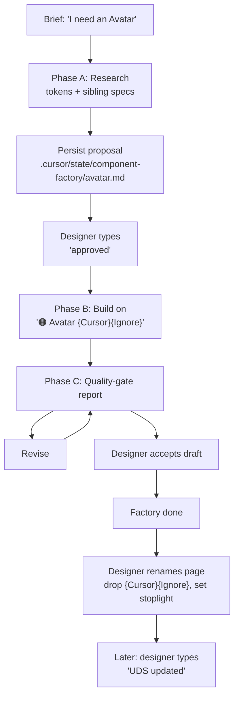

---
todos:
  - id: branch
    status: in_progress
    content: Create cursor/component-factory-skill-88ba branch off main
  - id: skill
    content: Write .cursor/skills/generate-uds-figma-component/SKILL.md
    status: pending
  - id: write-safety
    content: 'Add scope #4 to uds-figma-write-safety.mdc'
    status: pending
  - id: toolchain
    content: Regenerate .cursor/TOOLCHAIN.md
    status: pending
  - id: cursor-workflows
    content: Add new skill row to uds-docs/docs/pages/cursor-workflows.html
    status: pending
  - id: site-bump
    content: Bump SITE version + SITE_CHANGELOG entry (no cache-bust needed for this PR)
    status: pending
  - id: audits
    content: Run audit-toolchain-currency.sh and audit-agent-docs-currency.sh locally
    status: pending
  - id: commit
    content: 'Commit, push, open draft PR'
    status: pending
name: UDS Component Factory
overview: 'Add a new Cursor skill that drafts token-bound UDS component sets directly inside the UDS Components Figma file on `{Cursor}{Ignore}`-suffixed pages, with `figma-generate-library` as the engine and the existing `uds-updated` workflow doing the docs landing later.'
isProject: false
---

# UDS Component Factory Plan

Scope: UDS-only. The factory generates token-bound Figma component drafts so designers can review and accept them faster. It does not push to the docs site. Docs landing is the existing [`uds-updated`](.cursor/skills/uds-updated/SKILL.md) workflow, run on the designer's schedule.

## 0. Ground rules

The plan rests on five ground rules:

- **Pull first.** Implementation begins by confirming sync with `origin/main` and re-reading current Figma workflow rules and skills. Confirmed in this session — local at `1da15c2`, in sync.
- **Mainline file, draft pages.** Generated components are built directly inside the `UDS Components` Figma file (file key `1XJoUJgtNpw4R0IIT3VjoK`) on a brand-new page suffixed `{Cursor}{Ignore}`. The `{Ignore}` marker takes the page out of all UDS automation; the `{Cursor}` label tells designers it's a factory draft. Designer accepts by renaming the page (drop `{Cursor}{Ignore}`, set the stoplight prefix).
- **Factory stops at Figma.** The factory produces an approved Figma component set and stops. It does not write to `uds-docs/uds/`, does not run [`new-component`](.cursor/skills/new-component/SKILL.md), and does not run [`sync-figma-component-spec`](.cursor/skills/sync-figma-component-spec/SKILL.md). Docs landing is the existing [`uds-updated`](.cursor/skills/uds-updated/SKILL.md) skill, designer-initiated.
- **Model proposals are resumable.** The proposed component model is persisted to `.cursor/state/component-factory/<id>.md` so a session can resume and another designer can read what was proposed. `.cursor/state/` is already gitignored — proposals are runtime state, not committed history.
- **Build on existing patterns.** The factory skill loads `figma-generate-library` (cached plugin skill, lives outside the repo at `~/.cursor/plugins/cache/cursor-public/.../skills/figma-generate-library/`) as a prerequisite and inherits its state ledger (`setSharedPluginData('dsb','run_id',...)`), idempotency rules, and Phase 3 component pattern. It defines only UDS-specific deltas on top.

## 1. Purpose

The bottleneck is component throughput: teams need UDS components, and manually building each one in Figma is too slow.

The Component Factory takes a short component brief and returns a strong, token-bound Figma component set built from UDS Tokens, existing component patterns, and documented UDS rules. The designer remains the design lead and the approval authority; Cursor handles the repetitive construction, quality checks, and cleanup.

Success looks like:

- Faster first drafts for new components
- Consistent use of UDS Tokens for color, spacing, radius, type, border, and status treatments
- Better default coverage for anatomy, variants, states, accessibility, and naming
- Less manual Figma layer construction
- Clear, designer-controlled handoff from Figma draft page to mainline, and later to docs via `uds-updated`

## 2. Locked decisions (this conversation)

1. **Marker convention.** Factory creates pages in `UDS Components` named `🟠 <Title> {Cursor}{Ignore}` — orange/in-progress stoplight prefix + `{Cursor}` designer label + `{Ignore}` exclusion marker. The `{Ignore}` does the actual filtering, so existing [`figma-inventory`](.cursor/agents/figma-inventory.md), [`sync-figma-component-status`](.cursor/skills/sync-figma-component-status/SKILL.md), [`uds-updated`](.cursor/skills/uds-updated/SKILL.md), [`figma-spec-gap`](.cursor/agents/figma-spec-gap.md), and [`figma-component-inspector`](.cursor/agents/figma-component-inspector.md) all already skip these pages — no rule changes there required.
2. **Existing-page collision.** If the target `<Title> {Cursor}{Ignore}` page already exists, the factory inspects it and asks the user before destroying / rebuilding anything. Mirrors the [`figma-component-card`](.cursor/skills/figma-component-card/SKILL.md) update-mode pattern.
3. **Stoplight prefix while in review.** Page is born with `🟠` (in-progress, per [`uds-figma-preflight.mdc`](.cursor/rules/uds-figma-preflight.mdc) §"Stoplight status mapping"). When the designer accepts and "moves to mainline," the rename drops `{Cursor}{Ignore}` and updates the stoplight: `🟠 Avatar {Cursor}{Ignore}` becomes `🟡 Avatar` (review) or `🟢 Avatar` (production).
4. **Write safety.** Add a fourth allowed write scope to [`uds-figma-write-safety.mdc`](.cursor/rules/uds-figma-write-safety.mdc): "Component drafts on a page whose name contains `{Cursor}{Ignore}` in `UDS Components`." Any write to a page name without that suffix still requires explicit per-component user direction.

## 3. Existing building blocks the factory leans on

Mandatory prerequisites the factory skill must load:

- `figma-use` (cached plugin skill) — required before every `use_figma` call. Covers Plugin API basics: page-context reset, return-pattern, ID return, font preload, color range.
- `figma-generate-library` (cached plugin skill) — provides the state ledger, sequential-call rule, validation pattern, library-discovery pattern (`get_libraries` + `search_design_system`), and Phase 3 component pattern. Already lists `figma-use` as a prerequisite.

Used downstream by the designer, NOT by the factory:

- [`uds-updated`](.cursor/skills/uds-updated/SKILL.md) — top-level Figma-to-docs sync. Handles `new-component` scaffolding, `sync-figma-component-spec`, `link-figma-nodes`, status, changelog, cache-bust, commit. Designer-initiated.
- [`figma-component-card`](.cursor/skills/figma-component-card/SKILL.md) — optional Figma page layout build for the seven-section card. Designer-initiated, after the docs scaffold exists.

Rules the factory must respect:

- [`uds-figma-preflight.mdc`](.cursor/rules/uds-figma-preflight.mdc) — preflight before any Figma read or write.
- [`uds-figma-write-safety.mdc`](.cursor/rules/uds-figma-write-safety.mdc) — write summaries and scoped writes. The factory's writes only land in scope #4 (the new `{Cursor}{Ignore}` scope this plan adds).
- [`uds-token-architecture.mdc`](.cursor/rules/uds-token-architecture.mdc) — token vocabulary contract.
- [`uds-source-of-truth.mdc`](.cursor/rules/uds-source-of-truth.mdc) — factory never writes under `uds-docs/uds/`.
- [`uds-rule-discipline.mdc`](.cursor/rules/uds-rule-discipline.mdc) — `lastUpdated` bump + `bash scripts/regenerate-toolchain.sh` whenever a rule/skill/subagent file is touched.
- [`uds-master-preflight.mdc`](.cursor/rules/uds-master-preflight.mdc) Phase 5 step 11 — same toolchain bookkeeping, plus the row in [`cursor-workflows.html`](uds-docs/docs/pages/cursor-workflows.html).

## 4. Workflow at a glance

Everything below `factoryDone` is outside the factory's responsibility.

## 5. Phase A — Brief to model

The skill takes a short brief and proposes a component model before writing Figma.

Inputs the skill reads:

- The component brief.
- [`uds-docs/uds/components.json`](uds-docs/uds/components.json) to see what already exists. Proposed `id` must not collide.
- The 2–3 closest sibling components' `spec.json` files (each at `uds-docs/uds/components/<id>/spec.json`, schema at [`spec.schema.json`](uds-docs/uds/schemas/spec.schema.json)) for anatomy, states, accessibility patterns. **Read cap:** combined `spec.json` payload ≤ 30 KB to keep context budget intact. If siblings are larger, read only the relevant sections (`anatomy`, `states`, `accessibility`, `props`).
- [`uds-docs/uds/tokens/semantic.css`](uds-docs/uds/tokens/semantic.css) for available surfaces, text, borders, status treatments.
- [`uds-token-architecture.mdc`](.cursor/rules/uds-token-architecture.mdc) for the token-role contract.

Model output (written to `.cursor/state/component-factory/<id>.md`):

- Purpose and when-to-use guidance
- Anatomy: root, label, icon/content slots, helper text, action area, supporting parts
- Variant axes drawn from siblings where possible (size, emphasis, tone, state, density, orientation, selection, validation). Note: UDS does not have a standardized variant vocabulary — see §12 risk.
- State matrix (default, hover, active/pressed, focus-visible, disabled, selected, error, loading, empty) as appropriate
- Accessibility plan: keyboard, focus, screen reader, disabled / loading / error
- Token plan with explicit role-to-token mapping (e.g. `background.default` = `--uds-color-surface-interactive-default`)
- Sibling components to reuse as nested instances
- Assumptions and acceptance criteria in plain language for fast designer review

Resume protocol: if `.cursor/state/component-factory/<id>.md` already exists, the skill reads it and resumes from where the prior session left off rather than overwriting.

**Approval gate.** The skill must pause and wait for the literal word `approved` (case-insensitive) from the designer before any Figma write. "Looks good" / "fine" / "OK" do not count, matching `figma-generate-library` §"Explicit phase approval."

**Approval with changes.** If the designer says "approved, but change X" or "approved with: <list>", treat this as approval to proceed AFTER applying the requested model changes. Re-emit the updated proposal (overwriting the persisted markdown), confirm the changes are captured, then proceed to Phase B. Do not require a second `approved`. Pure rejection ("not yet" / "rework this") returns to Phase A research without writing.

## 6. Phase B — Draft page build

After the model is approved, the skill writes only to a new `{Cursor}{Ignore}` page on the `UDS Components` file.

Pre-flight (mandatory):

- Run [`uds-figma-preflight.mdc`](.cursor/rules/uds-figma-preflight.mdc) §"Mandatory preflight output."
- Call `get_libraries({ fileKey })` and confirm `libraries_added_to_file` includes `UDS Tokens`. If not, stop with instructions for the user to subscribe via Figma's library picker — same exit as [`figma-component-card`](.cursor/skills/figma-component-card/SKILL.md) §"Pre-flight" step 2. Never proceed with raw values.
- Tag every created node immediately with `setSharedPluginData('dsb','run_id', RUN_ID)` and a logical key, per `figma-generate-library` state ledger.
- Re-import variables in each `use_figma` call. Do not rely on stale variable IDs from prior calls (cited in [`figma-component-card`](.cursor/skills/figma-component-card/SKILL.md) gotchas).

The builder:

- Creates the page named `🟠 <Title> {Cursor}{Ignore}` if it doesn't exist; if it does, asks the user (per locked decision #2) before touching anything.
- Creates a component set with clean variant properties using the agreed vocabulary.
- Builds variants and states with auto-layout. Defaults: containers hug content unless a fixed dimension is part of the spec; padding axes use UDS spacing tokens, not raw pixels; flat structure preferred unless nesting is required.
- Binds fills, strokes, type, spacing, and radius to UDS Tokens via the role-to-token map from Phase A.
- Uses existing UDS components as nested instances where appropriate.
- Uses meaningful layer names.
- Returns all created/mutated node IDs.
- Emits the standard Figma write summary per [`uds-figma-write-safety.mdc`](.cursor/rules/uds-figma-write-safety.mdc) §"Required before/after report."

If a needed token is missing from UDS Tokens, the factory STOPS and asks. New tokens flow through the UDS Tokens Figma file → [`import-figma-tokens`](.cursor/skills/import-figma-tokens/SKILL.md) skill, never through this factory's `use_figma` calls.

**Post-build verification (mandatory before Phase C).** Per `figma-generate-library` rule 12 ("Validate before proceeding") and the use_figma skill's "always read IDs from the state ledger" guidance:

- Call `get_metadata` on the new page node to confirm structure (page child count, component-set children, variant-property names match the approved model).
- Call `get_screenshot` on the page node to capture a visual record.
- Cross-check that every created node ID returned by the build call is present in the metadata response. Any missing or duplicate ID stops the run for investigation — the quality-gate report does not run on unverified work.

## 7. Phase C — Quality-gate report

The first draft is not production-ready by default. Goal: a high-quality starting point + a clear report of what still needs review.

After the build, the skill emits a structured report with two sections.

**Tool-emitted gates (deterministic):**

- **Token bindings.** Raw color/fill/stroke values found: N. Unbound corner radii: N at `<nodeIds>`. Unbound spacing: N at `<nodeIds>`. Unbound typography: N.
- **Variant matrix.** Generated variant axes and values vs. approved model. Match / mismatch report.
- **Layer hygiene.** Unnamed nodes: N. Generic names (`Frame N`, `Rectangle N`): N. Orphan top-level nodes on the page: N.
- **Auto-layout coverage.** Frames without auto-layout: N at `<nodeIds>`.

**Human-judged gates (Cursor flags; designer decides):**

- **State coverage.** Are all states present and visually distinguishable?
- **Accessibility plan.** Is the documented keyboard / focus / SR behavior plausible and complete?
- **Visual direction.** Does the draft match the intended UDS feel?

If any tool-emitted gate fails with non-zero findings, the skill reports the issue and proposes a fix. Design-changing, destructive, or token-creating fixes require explicit approval.

**Review-ready definition.** Tool-emitted gates report zero findings AND human-judged gates have been written into a designer-facing prompt block. That is the quality bar for "factory job complete." Production-ready is a different bar that happens later, in `uds-updated`.

## 8. After approval (designer-owned)

When the designer accepts the draft, factory's job is done. What happens next is NOT the factory's responsibility:

- The designer renames the page in `UDS Components` to drop `{Cursor}{Ignore}` and update the stoplight prefix to whatever status they want (`🟠` in-progress, `🟡` review, `🟢` production).
- When the designer is ready (same day, weekly sync, whatever), they type `UDS updated` or equivalent. The existing [`uds-updated`](.cursor/skills/uds-updated/SKILL.md) skill handles the rest: `new-component` scaffold, `sync-figma-component-spec`, `link-figma-nodes`, status, changelog, cache-bust, commit, push.
- Optionally, the designer may run [`figma-component-card`](.cursor/skills/figma-component-card/SKILL.md) to build the seven-section page layout in Figma. Independent of the factory.

The model proposal at `.cursor/state/component-factory/<id>.md` can be deleted once the component has landed in docs, or left in place — cleanup is optional, since `.cursor/state/` is gitignored.

## 9. Supporting skills (deferred)

After the factory works for one pilot, add support skills only if pilot data justifies them:

- **`.cursor/skills/optimize-uds-figma/SKILL.md`** — reusable quality and hygiene checks on generated or existing components. Read-only by default; applies fixes only after approval.
- **`.cursor/skills/purge-failed-factory-run/SKILL.md`** — cleanup utility that targets nodes by `run_id` from the state ledger. Removes orphaned draft nodes from failed/partial builds. No name-guessing.
- **`.cursor/skills/wire-figma-component-interactions/SKILL.md`** — wires hover/click/state reactions after the component set exists. Reads existing reactions first; preserves them unless replacement is explicitly approved.

Design tweaks remain a chat workflow until repeated real examples justify a dedicated skill.

## 10. Pilot defaults

Pilot must be:

- More complex than a static badge
- Less complex than data table, menu, combobox, or calendar
- At least two variants and four states
- Reuses existing UDS patterns (`Button`, `Text Input`, `Card`, `Notification`, `Icon Wrapper`, `Badge`)
- NOT in [`uds-docs/uds/components.json`](uds-docs/uds/components.json) (all 29 listed are out of scope as pilots)

Plausible candidates that don't exist today: **Avatar** (recommended pilot), Banner, Stepper, Skeleton, Empty State, Toast, Accordion. Confirm against the actual component backlog before the pilot run.

Default quality target for the factory's pilot: review-ready draft on a `{Cursor}{Ignore}` page, not production-ready. Production readiness happens after designer rename + the eventual `uds-updated` run.

## 11. Pilot success / kill criteria

Real numbers, not hopes:

- **Baseline first.** Before the pilot, designer estimates how long an Avatar would take to build manually in Figma (a number, even if rough — 30 min, 90 min, etc.). Without a baseline there is no "speedup" to measure.
- **Success.** Total round-trip time (agent build + designer review rounds + any rebuild) < manual baseline, AND the designer accepts the draft within ≤ 3 review rounds.
- **Kill.** First pilot exceeds 2× the manual baseline, OR the designer rebuilds the result from scratch instead of iterating on it (designer judgment — meaning the accepted version replaces most of the layer structure rather than tweaking what the factory produced). If killed, the skill stays in repo as a documented experiment but is not expanded; the gap moves to a different tool (e.g. a model-proposal-only skill that stops before Figma).
- **Don't expand without proof.** No `optimize-uds-figma`, `purge-failed-factory-run`, `wire-figma-component-interactions`, or batch mode until 3 distinct pilots (one atomic, one with multiple variant axes, one with a state matrix) have all met the success criteria above.
- **Calibration targets, not contracts.** The original plan estimated 15–45 min agent time on first pass settling to 5–15 min, and 20–40 sequential `use_figma` calls per component. Treat these as calibration ranges to test against the baseline, not as "success."

## 12. Open risks

- **Factory does not promote to docs.** Mainline rename + `uds-updated` are designer-initiated separate steps. Accepted components can sit in Figma without docs presence — intended posture, but worth tracking.
- **Some components require behavior Figma prototypes can't represent well.** First skill should not attempt complex overlays, positioning, virtualization, or rich keyboard interaction.
- **No standardized UDS variant vocabulary.** Sibling components are inconsistent (`Button` uses `tone`/`size`/`shape`/`state`; `Notification` uses `priority`/`emphasis`/`state`; `Chip` uses `tone`/`size`). Factory will inherit this inconsistency. Out of scope to fix here.
- **Token-map drift.** Like [`figma-component-card`](.cursor/skills/figma-component-card/SKILL.md), the factory binds via library variable keys. UDS Tokens renames will silently break the factory until the token map is updated. Mitigation: factory must call `get_libraries` and verify `UDS Tokens` is subscribed before any binding write.
- **Some visual decisions may require new tokens.** Factory must stop and ask, not invent. New tokens come through the UDS Tokens Figma file and `import-figma-tokens`.
- **Batch mode can create low-quality volume if review gates are weak.** Per-component designer approval gates batch runs.
- **Maintenance burden as UDS conventions evolve.** Variant-vocabulary or token-architecture changes require the factory skill to be updated, or it drifts. Skill should be on the toolchain currency audit.
- **Token library subscription dependency.** UDS Tokens library must be subscribed in `UDS Components`. If not, the factory stops; it cannot subscribe libraries on the user's behalf.
- **Resumability and cleanup.** If `purge-failed-factory-run` lags the rest of the build order, the file accumulates `{Cursor}{Ignore}` cruft. Designer can delete those pages manually; they don't affect inventory because `{Ignore}` filters them.
- **Designer-review time is part of the cost.** Success metric in §11 counts it; the original "15–45 min agent time" signal does not.

## 13. Files this PR adds or changes

- **New skill** `.cursor/skills/generate-uds-figma-component/SKILL.md` — the factory itself. Frontmatter (`name`, `description`, `lastUpdated`), prerequisites (load cached `figma-use` + `figma-generate-library`, follow `uds-figma-preflight.mdc` and `uds-figma-write-safety.mdc`), Phase A / B / C, explicit-approval gates, run-id state ledger inherited from `figma-generate-library`, write summary template.
- **Rule update** [`.cursor/rules/uds-figma-write-safety.mdc`](.cursor/rules/uds-figma-write-safety.mdc) — add the fourth allowed write scope: "Component drafts on a page whose name contains `{Cursor}{Ignore}` in `UDS Components`." Bump `lastUpdated`.
- **Toolchain index** `.cursor/TOOLCHAIN.md` — regenerated by `bash scripts/regenerate-toolchain.sh` (do not hand-edit; the regenerator overwrites).
- **User-facing index** [`uds-docs/docs/pages/cursor-workflows.html`](uds-docs/docs/pages/cursor-workflows.html) — add a row for the new skill or `audit-agent-docs-currency.sh` will fail.
- **SITE bump** — `bash uds-docs/bump-site.sh` plus a `SITE_CHANGELOG` entry in [`uds-docs/docs/data/site-changelog.js`](uds-docs/docs/data/site-changelog.js) because `cursor-workflows.html` is under `uds-docs/`.
- **Cache-bust** — none required for this PR. The `?v=N` query params in `index.html` only apply to the assets it references directly (`docs/app.js`, `uds/uds.css`, `docs/site.css`, etc.). `cursor-workflows.html` is a page fragment fetched at runtime by `app.js` via `fetch-versioned.js`, so it has no static `?v=N` and doesn't need a bump. None of `app.js`, `site.css`, or `uds.css` change in this PR.
- **Runtime state, NOT committed** `.cursor/state/component-factory/<id>.md` — model proposals. `.cursor/state/` is already gitignored via [`.gitignore`](.gitignore) line 2 (`.cursor/*` blanket-ignore on line 2, with allowlist exceptions on lines 3–16 for rules/skills/agents/figma/hooks/environment.json/hooks.json/desktop-preview.sh/TOOLCHAIN.md). No `.gitignore` change needed.

## 14. Build order for this PR

The order below honors [`uds-master-preflight.mdc`](.cursor/rules/uds-master-preflight.mdc) Phase 3 ("bump-site.sh runs FIRST when any `uds-docs/` file is modified"). Steps 3–5 only touch `.cursor/`, so the bump can wait until just before the first `uds-docs/` edit.

1. **Confirm sync state.** Already done — local at `1da15c2`, in sync with `origin/main`.
2. **Branch.** `git checkout -b cursor/component-factory-skill-88ba` off main.
3. **Write the skill** at `.cursor/skills/generate-uds-figma-component/SKILL.md`. Single file, no `references/` subdir for now — keep minimal until pilot runs prove which patterns repeat enough to extract. Frontmatter MUST include `name`, `description`, and `lastUpdated:` set with `date -u +%Y-%m-%dT%H:%M:%SZ` (never guessed) per [`uds-rule-discipline.mdc`](.cursor/rules/uds-rule-discipline.mdc).
4. **Update write-safety rule.** Add scope #4 to [`uds-figma-write-safety.mdc`](.cursor/rules/uds-figma-write-safety.mdc). Bump its frontmatter `lastUpdated:` using the same `date -u` command.
5. **Regenerate `TOOLCHAIN.md`** with `bash scripts/regenerate-toolchain.sh`. Confirm the new skill row appears under Skills (count goes 8 → 9) and the rule's date column updated.
6. **SITE bump (FIRST uds-docs/ touch).** `bash uds-docs/bump-site.sh`. The script updates `uds-docs/version.txt` and `uds-docs/index.html` (display + inline `SITE_VERSION`) per [`uds-site-changelog.mdc`](.cursor/rules/uds-site-changelog.mdc). Capture the new version string from the script output. [`uds-master-preflight.mdc`](.cursor/rules/uds-master-preflight.mdc) Phase 3 also asks for an immediate stub `SITE_CHANGELOG` entry; for this small PR we collapse stub + final into step 8 (single `added` entry written once we know the final scope of changes). Do not split.
7. **Update `cursor-workflows.html`** with a row for the new skill — match the existing row format under the Skills section so `audit-agent-docs-currency.sh` passes.
8. **Add SITE_CHANGELOG entry** in [`uds-docs/docs/data/site-changelog.js`](uds-docs/docs/data/site-changelog.js) using the version string from step 6. Single `added` entry mentioning the new skill + the new write-safety scope. No `?v=N` cache-bust needed (see §13).
9. **Run audits locally + visual check.**
   - `bash scripts/audit-toolchain-currency.sh` (must pass)
   - `bash scripts/audit-agent-docs-currency.sh` (must pass)
   - Open `http://localhost:4000/#/cursor-workflows` and confirm the new skill row appears under Skills and links to the new SKILL.md file. Also confirm the SITE version footer matches `version.txt`.
10. **Commit + push + open draft PR.**
    - Single commit. Message: `Add generate-uds-figma-component factory skill (no Figma writes yet)`.
    - PR title matches commit message. PR body summarizes the four locked decisions, the new write-safety scope #4, and explicitly notes "no pilot run included — that's a separate designer-initiated session."
11. **Pilot run** — separate, designer-initiated, after this PR merges. Out of scope for this PR per §15.

## 15. Out of scope for this PR

- Implementing the pilot run itself. That happens after this PR merges and the designer is ready.
- Any change to [`uds-docs/uds/`](uds-docs/uds/). Factory never writes there. Docs landing is `uds-updated`'s job.
- Building `optimize-uds-figma`, `purge-failed-factory-run`, `wire-figma-component-interactions`, or batch mode. Those wait for proof-of-value per §11.
- Adding `{Cursor}` as its own filter to existing rules. The locked decision uses `{Ignore}` for filtering, so no rule changes there.
