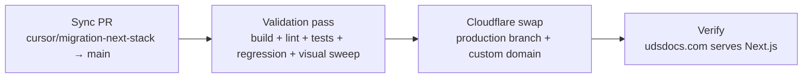

# UDS Docs Migration — Chunk 18 Cutover Plan

## Where we are right now

The migration is almost done. Status as of `2026-05-26 19:24 UTC`:

- **Chunks 01–17 are merged.** Both `main` and `cursor/migration-next-stack` carry the Next.js stack. The legacy `uds-docs/docs/`, `uds-docs/index.html`, `uds-docs/version.txt`, `uds-docs/bump-site.sh`, and `.github/workflows/deploy.yml` are all deleted from `main`.
- **Cloudflare Pages** is set up per Chunk 00 — project `uds-docs-next`, production branch `cursor/migration-next-stack`, serving `staging.udsdocs.com`.
- **Recent review-driven work is on `cursor/migration-next-stack` but not yet on `main`.** PR #74 (post-Opus findings — client nav, theme persistence, archive init/validation, prose link routing, regression CI) and PR #75 (`SITE 2026.05.24.0` migration entry) both merged today into `cursor/migration-next-stack` but `main` is behind by those 23 files of changes.
- **`main` no longer has the GH Pages deploy workflow** (Chunk 17 deleted it), so `udsdocs.com` has been silently stuck on whatever the last GH Pages deploy was. This is fine per the original "live site downtime during migration is acceptable" decision, but it means cutover should not be deferred indefinitely.
- **CI on `main`** runs UDS Audits + Next.js Build & Lint — both green on the latest commit.

## What's left

Just the final cutover. Split into three slices:



## Phase 1 — Cutover PR (agent-runnable)

`main` is missing the post-Opus findings + the SITE migration entry. Open the cutover PR directly from `cursor/migration-next-stack` → `main`. This matches the original Chunk 18 brief and is the only PR that needs to move during cutover.

**Steps:**

1. Confirm `cursor/migration-next-stack` is at `e0bc167` (or newer) and `main` is at `33d37ae` (or whatever's current). Diff should be the PR #74 + PR #75 content — roughly 23 files, ~544 insertions / ~97 deletions concentrated in `uds-docs/components/site/`, `uds-docs/app/(site)/`, `uds-docs/data/site-changelog.ts`, `uds-docs/scripts/regression-recovery-check.mjs`, `AGENTS.md`, `.github/workflows/next-build.yml`.
2. Check no PRs are open against `cursor/migration-next-stack` (`gh pr list --state open --base cursor/migration-next-stack`). If any are open, ask the user before proceeding — they'd need to be retargeted to `main` after cutover.
3. Open a PR with `cursor/migration-next-stack` as the head and `main` as the base. Title something like `Cutover: merge cursor/migration-next-stack → main`. Body should link to this plan, the most recent SITE entry, and the regression-check result.
4. **Stop and hand to the user for review + merge.** Per the new workflow rule, the agent does not merge.
5. **Do not create a sync feature branch first.** The previous version of this plan suggested routing through `cursor/cutover-sync-<suffix>`; that's unnecessary and was removed during plan review.

## Phase 2 — Pre-cutover validation (agent-runnable, no PR — runs against the Phase 1 PR branch or main after the Phase 1 PR merges)

These are the gates from the original Chunk 18 brief plus what's accumulated since. All must pass before the user is asked to do anything in the Cloudflare dashboard.

```bash
cd uds-docs/
npm ci
npm run gen:types:check     # types/uds.ts in sync with JSON schemas
npx tsc --noEmit            # type-check clean
npm run lint                # 0 errors (warnings OK — see known-issues note below)
npm test                    # vitest, 30/30
npm run build               # static export clean
npm run regression-check    # headless-Chrome sweep, 18 cases
bash scripts/audit-component-completeness.sh
bash scripts/audit-doc-internal-consistency.sh
bash scripts/audit-changelog-currency.sh
bash scripts/audit-aggregate-currency.sh
```

Sanity-check `https://staging.udsdocs.com/uds/version.json`, `/uds/uds.css`, `/versions.json`, `/versions/0.2/uds/components.json` all return 200 (the Chunk 01 done-when criteria — still applicable since the postbuild copy strategy hasn't changed).

If anything fails: fix in the same PR or open a follow-up PR before the user does the Cloudflare swap.

## Phase 3 — End-to-end manual validation (user, in browser, against `staging.udsdocs.com`)

The agent can't drive the visual pass; the user runs through this checklist before the dashboard swap. Should be a 15-30 minute pass.

- **Every page** in the sidebar loads and shows correct content.
- **Every component page** (29 components): Examples / Code / Guidelines / Changelog tabs render; Playground tab works where present (hidden for combobox, data-view, date-picker).
- **All 6 themes** flip cleanly: Base Light, Base Dark, ResMan Light, ResMan Dark, AnyoneHome Light, Inhabit Light.
- **Appearance settings survive navigation and refresh** (the post-Opus fix).
- **Version dropdown**: switch to `UDS 0.2`, confirm sidebar filters to 0.2 components, archive banner appears, archive-incompatible features hide (Playground, Implementation Reference, Build Demo).
- **Token Search** (`/` shortcut): keyboard nav, click-to-copy.
- **Contrast Checker** at `/contrast-checker`: hero panel + browse mode work.
- **Demo Builder**: open dialog, generate preview, ZIP export.

## Phase 4 — Cloudflare cutover (user, in Cloudflare dashboard)

The agent can't drive Cloudflare's UI. Two changes in the `uds-docs-next` Pages project, in this order:

1. **Change production branch from `cursor/migration-next-stack` to `main`.** Triggers a fresh build from `main`. **Wait for the build to succeed before moving on.** If it fails, fix on `main` (new PR) and let the build retry — don't add the custom domain on a broken build.
2. **Add `udsdocs.com` as a custom domain** on the same project. Cloudflare auto-updates the DNS record (registrar and DNS are both in Cloudflare). Propagation is usually immediate.
3. Optional: rename project from `uds-docs-next` to `uds-docs` now that there's no parallel-rebuild concern.
4. Optional: keep or remove `staging.udsdocs.com`. Keeping it as a permanent staging URL is useful for future work.

### Rollback

The Cloudflare production-branch swap is reversible. If the post-swap deploy goes wrong:

1. In the same Pages project, change production branch back to `cursor/migration-next-stack`.
2. Cloudflare redeploys from the last-known-good build of that branch.
3. `udsdocs.com` either keeps serving the new (possibly broken) build until the rollback build finishes, OR — if the custom-domain swap also happened — removing `udsdocs.com` as a custom domain on `uds-docs-next` is the fastest revert.

Don't delete `cursor/migration-next-stack` until you're confident the new `main` deploy is healthy (covered in Phase 6 below).

## Phase 5 — Verify cutover (user, then agent confirms via PR comment if asked)

- `udsdocs.com` now serves the Next.js app, not the GH Pages snapshot.
- `udsdocs.com/uds/version.json` returns the current UDS version.
- Smoke-test a handful of pages: home → /button → /contrast-checker → /changelog → an archive view.
- GitHub Pages deploys are no longer firing (no `deploy.yml` workflow exists on `main`; GH Actions shows only `audits.yml` + `next-build.yml` running).
- Optional cleanup: in the GitHub repo settings, disable GitHub Pages entirely under Settings → Pages.

## Phase 6 — Post-cutover cleanup (agent-runnable after Phase 5 is green)

Optional but recommended; each item is independent so they can ship as separate small PRs.

1. **`SITE_CHANGELOG` entry for the cutover.** `SITE 2026.05.24.0` covered the new stack shipping to `staging.udsdocs.com`. The moment `udsdocs.com` actually serves Next.js deserves its own dated entry — write it in designer voice, lead with the answer.
2. **Delete merged feature branches.** Once `main` carries the migration, the per-chunk branches (`cursor/migration-01-skeleton-*` through `cursor/migration-17-cleanup-*`, plus the regression-recovery and review-fixes branches) are historical clutter. `gh pr list --state merged --base cursor/migration-next-stack` enumerates them; `git push origin --delete <branch>` removes them from the remote. Leave the merge commits in `main`'s history — the per-chunk PR descriptions are still discoverable via the GitHub UI.
3. **Decide whether to keep `cursor/migration-next-stack`.** Options:
   - **Delete it.** Cleanest. Future work goes off `main`. Re-create a new long-lived staging branch only if a comparable rebuild is needed again.
   - **Keep it as a permanent staging branch.** Useful if Cloudflare's preview-from-`main` workflow ever isn't enough and a stable staging URL needs to stay live. Means `staging.udsdocs.com` keeps existing.
4. **Update `.cursor/plans/`.** Mark the three migration plan documents (`uds-docs-nextjs-migration.md`, `next-migration-findings.md`, `post-opus-migration-findings.md`, and this `uds-docs-cutover.md`) as `status: completed` in their YAML frontmatter so the next agent doesn't pick them up as pending work.

## Known issues that are NOT cutover-blocking

These were surfaced during the post-Opus review pass and were intentionally deferred — capture here so the cutover agent doesn't get stuck on them:

- **`versions/0.2/` archive is sparse.** Only ships `<id>.css`, `spec.json`, `status.json`, `changelog.json` per component (no `examples/`, no `impl.json`, no `playground.js`). [`AGENTS.md`](AGENTS.md) §"Archive contract" documents this. The Examples tab + Implementation Reference + Playground all surface scoped messages or hide in archive mode. **Backfilling examples/impl into 0.2 is a content decision** (Figma source-of-truth boundary) and not in scope for cutover.
- **Two ESLint warnings** (`react-hooks/refs`, `react-hooks/set-state-in-effect`) remain as warnings. They flag idiomatic patterns the codebase uses on purpose. Promoting to errors needs a refactor; deferred.
- **Storybook is still a placeholder.** Component-page header links to `https://storybook.example.com`. Real Storybook URL gets wired when Storybook itself ships.

## Resume checkpoint

If the new agent picks this up partway through, the first thing to check is the diff between `main` and `cursor/migration-next-stack`:

```bash
git fetch origin
git log origin/main..origin/cursor/migration-next-stack --oneline
```

If empty → Phase 1 already shipped, jump to Phase 2/3 validation against `main`. If non-empty → Phase 1 PR hasn't merged yet. Don't open a duplicate sync PR; check open PRs first with `gh pr list --state open --base main`.
