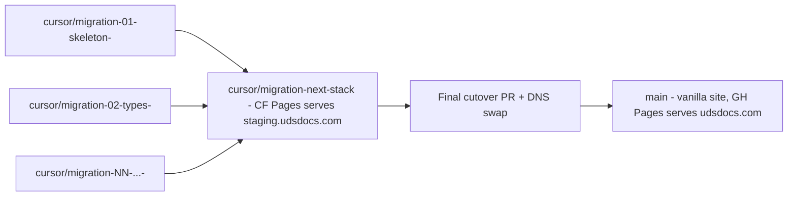
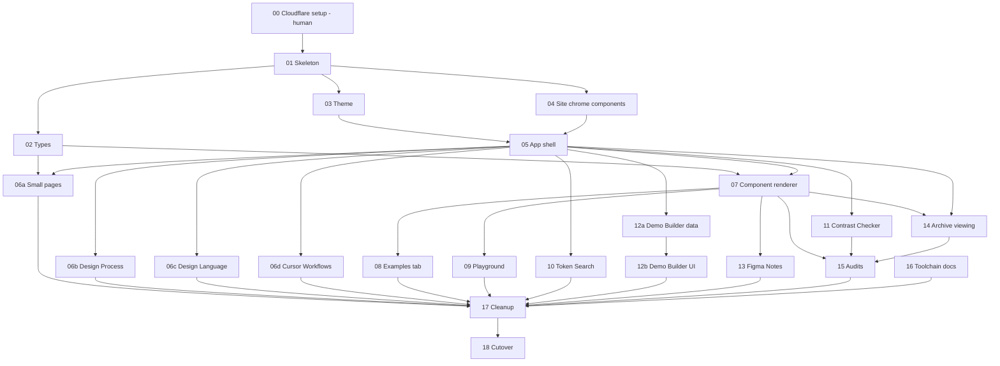

# UDS Docs Next.js Migration

## Background

**UDS** (Urban Design System) is a design system documented at `udsdocs.com`. The docs site lives in `uds-docs/` of this repo. It has two distinct parts:

- **The design system itself** (`uds-docs/uds/`): tokens (`tokens/*.css`), per-component folders (CSS, JS, `spec.json`, `status.json`, `changelog.json`, `examples/`, `impl.json`, `playground.js`), schemas, version manifests. This is what consumer apps import.
- **The documentation site that displays the design system** (`uds-docs/index.html` + `uds-docs/docs/`): a vanilla HTML/CSS/JS app with a hand-rolled SPA router that loads component pages, renders specs, runs the Playground and Demo Builder, etc.

This migration affects only the **second** part. The design system itself does not change. The rule [.cursor/rules/uds-source-of-truth.mdc](.cursor/rules/uds-source-of-truth.mdc) governs that boundary in detail.

## Why this migration

Three converging reasons:

1. **The current SPA router has structural fragility.** A specific bug surfaced this: the page-fragment loader in `docs/app.js` caches "I'm already loading this" before fetching, and never clears the cache on failure. A single transient fetch error leaves the user with a permanently-blank page until they refresh. The bug itself is a one-line oversight, but the broader pattern — hand-rolling routing, lazy loading, error handling, recovery — has accumulated similar fragilities and will keep doing so as the site grows.

2. **The site has outgrown vanilla.** ~2,900 lines of router/orchestration in `app.js`, ~2,800 lines of CSS, 13 page fragments, 13 modules (Demo Builder, Playground, Contrast Checker, Token Search, Figma Notes), version-aware archive viewing, theme switching across 6 themes. A framework would have given us routing, lazy-loading, and error handling for free; staying vanilla means continuing to hand-roll those concerns.

3. **It positions the site for the long-term dog-food story.** Eventually the docs site should be visibly "built with UDS" — sidebar, header, page tabs all rendered with `udc-*` components rather than the `.sg-*` site-specific chrome. That's explicitly out-of-scope for this migration (see below), but the React-based stack makes it credible. Today's vanilla approach doesn't.

## Key decisions and constraints

These decisions shaped the plan. Recorded here so a future reader doesn't have to re-derive them.

- **Stack: TypeScript + React + Next.js + Cloudflare Pages.** Chosen for "mainstream, won't disappear, large hiring pool, AI tools know cold." Alternatives considered and rejected: Astro (excellent for docs sites, but smaller community), Vue/Nuxt (smaller than React ecosystem), SvelteKit/Solid (real frameworks but small communities). The user's hard constraint: avoid niche tech that could be abandoned, and pick something Cursor agents have a mountain of training data for.
- **Static-export build (`output: 'export'`), not SSR.** A docs site doesn't need a server runtime. Static export works on Cloudflare's free tier with no caveats, and forces clean separation between build-time content and client-side interactivity. This decision has downstream implications — see Chunk 14, which has to design version-aware archive viewing entirely client-side.
- **Hosting: Cloudflare Pages, not Vercel.** The user already has a Cloudflare account, owns `udsdocs.com` through Cloudflare, and uses Cloudflare DNS. Vercel would be the natural Next.js choice but adds an account; Cloudflare's free tier is generous and the integration is trivial because DNS is already in-house. If we ever needed server features, the calculus would shift back toward Vercel.
- **Live site downtime during migration is acceptable.** The user explicitly said the live site is not a concern during the rebuild. This let us skip parallel-rebuild complexity. `main` keeps deploying the vanilla site to GitHub Pages until the very end; the rebuild lives on a long-lived branch served from Cloudflare Pages at `staging.udsdocs.com`; final cutover is one merge plus a DNS swap.
- **Keep the Demo Builder.** Was considered for removal to cut scope; user opted to keep it. It's a wow-factor feature and the most credible compositional demo of UDS in the docs.
- **Don't replace `.sg-*` chrome with UDS components in this migration.** Several UDS components aren't yet feature-rich enough for chrome duties. The "site is built with UDS" dog-food redesign is a separate, post-migration project. This migration ports the existing `.sg-*` chrome as-is. Detail in the "Out of scope" section below.
- **Chunk size: ~one cloud-agent-session of work per PR.** Cursor cloud agents can error out on long-running sessions, and when they do, it's hard to tell what was completed. Hence the strict per-chunk protocol below: frequent commits, PR description as live checklist, explicit resume protocol if an agent stops mid-chunk.

## How to use this plan

- This plan is designed to be executed chunk-by-chunk by Cursor cloud agents, one PR at a time. The dependency graph below shows which chunks can run in parallel.
- Each chunk's section is the complete brief for an agent assigned to that chunk. An agent should not need additional context beyond their chunk's section, the per-chunk protocol, and the Background / Key Decisions above.
- The plan owner (a designer who runs UDS via cloud agents) reviews each chunk PR before merging into the rebuild branch.
- Chunk 00 is the only human-driven step; everything else is agent-runnable.

## What does and does not change

Stays untouched: everything under [uds-docs/uds/](uds-docs/uds/) — tokens, component CSS, `spec.json` files, examples, schemas, status, changelogs. Plus the Figma-sync skills, the `release.sh` UDS-versioning workflow, and the design-system audit scripts (`audit-token-usage.sh`, `audit-component-completeness.sh`, `audit-placeholders.sh`, etc.) that only read `uds/`.

Gets rewritten: the entire rendering layer — [uds-docs/index.html](uds-docs/index.html) (the SPA shell), [uds-docs/docs/app.js](uds-docs/docs/app.js) (2,926 lines), [uds-docs/docs/site.css](uds-docs/docs/site.css) (2,820 lines), all 13 files in [uds-docs/docs/pages/](uds-docs/docs/pages/), all 13 files in [uds-docs/docs/modules/](uds-docs/docs/modules/), [uds-docs/docs/helpers/](uds-docs/docs/helpers/), the SITE-versioning apparatus (`version.txt`, `bump-site.sh`, the inline auto-cache-bypass script).

Gets updated: the audit scripts and `.cursor/` rules + skills that quote specific paths from the old `docs/` folder.

## Target stack

- TypeScript everywhere
- React (UI library)
- Next.js 15 with App Router (framework)
- Plain CSS + UDS tokens for the design system itself (unchanged)
- The current `.sg-*` site chrome (header, sidebar, page tabs, page titles, subsections, brand bar, version dropdown) is ported as-is into the new app. The CSS rules in [uds-docs/docs/site.css](uds-docs/docs/site.css) move to `styles/site/` (plain CSS, not CSS Modules — the `.sg-*` class names stay global), organized per-concern. React chrome components produce the same `.sg-*` markup the current site already uses. No attempt to replace `.sg-*` with UDS components in this migration.
- Page-local styles (e.g. `.sg-dl-*` for Design Language, `.sg-cw-*` for Cursor Workflows, `.cc-*` for Contrast Checker) follow the same pattern: plain CSS, prefixed class names, scoped by file location.
- Cloudflare Pages (hosting, deploy on push)

## Out of scope: the long-term dog-food goal

The aspirational version of this site has its chrome rendered with UDS components — sidebar built with `udc-nav-vertical`, header buttons with `udc-button`, page tabs with `udc-tabs`, the Build Demo modal with `udc-dialog`, etc. That's a credible "this site is built with UDS" story.

It's intentionally **not** part of this migration. Reasons:

- Several UDS components aren't yet feature-rich enough to take on chrome duties (e.g. the sidebar's section-heading + active-link + draft-hidden patterns don't map cleanly onto `udc-nav-vertical` as it stands today).
- Folding the dog-food redesign into the stack migration would conflate two different decisions (technical migration vs. visual/functional redesign).
- The migration is already large; expanding scope risks it never finishing.

The dog-food work becomes a separate, post-migration project: once the Next.js + React app is in production and stable, components-needed-for-chrome can be promoted to UDS one at a time as those UDS components mature. That's a much easier conversation when the site itself isn't mid-rebuild.

Implication for this plan: there are no "React wrappers for chrome UDS components" anywhere. The only UDS-component React usage is wherever it's strictly required (Demo Builder's dialog markup, for example) and is built one-off in the chunk that needs it.

## Branch strategy

- **Long-lived rebuild branch**: `cursor/migration-next-stack`. Stable name, no per-session suffix (it's shared infrastructure across every chunk's agent). PR'd into `main` only at cutover.
- **Per-chunk branches**: `cursor/migration-NN-<slug>-<suffix>`, where `NN` is the chunk number and `<suffix>` is whatever the cloud agent's runtime assigns to that session. Agents do not invent suffixes; they use the one their cloud-task instructions provide. PR'd into the long-lived rebuild branch, not into `main`.
- `main` keeps deploying the current vanilla site to GitHub Pages throughout the migration. `udsdocs.com` stays pointed at GH Pages via the existing Cloudflare-managed DNS until Chunk 18.
- A single Cloudflare Pages project deploys the rebuild branch with the Next.js Static Export build. Bound to `staging.udsdocs.com` (or `next.udsdocs.com` — designer's pick) so there's a stable URL to bookmark for the duration of the migration. Per-PR branch previews on `*.pages.dev` give every chunk its own visual-diff URL.



## Per-chunk protocol (signs of life)

Every chunk agent follows this sequence so the user can always see what was done, even if the agent errors out mid-session. The protocol is designed to work with the minimum tool surface: branch + commits + push + PR-body create/update. It does not assume the agent can post PR comments or flip draft-to-ready, since those aren't reliably available across all cloud-agent environments.

1. **Start of session**: create branch `cursor/migration-NN-<slug>-<suffix>` from `cursor/migration-next-stack` using whatever `<suffix>` the cloud-task instructions assign. First commit is the first real file the chunk creates (e.g. `package.json` for Chunk 01, `types/uds.ts` for Chunk 02) — even if minimal/stub. Push immediately. This commit proves the agent started.
2. **Create the PR immediately** (draft if the create tool supports it; otherwise non-draft is fine — `[WIP]` prefix in the title signals state). PR description IS the chunk's checklist — copy the "Done when" bullets from the chunk below into the body as `- [ ]` items. The PR body is the single source of truth for progress.
3. **Commit + push after every meaningful step**. Each commit message names the step (`Chunk NN step 3: port the search trigger button`). Pushed commits are visible events in the PR's commit history. Do not batch commits.
4. **Update the PR body** after each meaningful step: tick the corresponding checklist item with `- [x]`, append any new sub-items the agent discovers it needs, and update a short status line at the top (`Status: in progress — currently on step 4 of 7`). The PR body is the live status board.
5. **End of session**: append a final `## Summary` section to the PR body listing what landed and what didn't, and link or inline-embed before/after screenshots of the Cloudflare Pages preview for any chunk that changed visible UI (chrome, content pages, dynamic features). Remove the `[WIP]` title prefix if used. If checklist items remain unchecked, the PR body explicitly names which one a resuming agent should pick up next.
6. **Resume protocol**: if a chunk's PR exists with unchecked items in its body, a fresh agent reads the body, identifies the first unchecked item, continues from there. The commit log + PR title (chunk number + slug) provides full orientation; no other context document is needed.

## Chunk dependency graph



Parallelism note: chunks 02, 03, and 04 are independent of each other and can run as three concurrent agent sessions once Chunk 01 lands. The page-content chunks (06a/b/c/d) are also independent of each other and can run in parallel once both Chunk 05 (shell) and Chunk 02 (types, for 06a only) are in. Chunks 08, 09, 13 can run in parallel once Chunk 07 lands. Chunks 10, 11, 12a can run in parallel once Chunk 05 lands. Chunk 15 must wait for the feature chunks it audits (07, 11, 14); Chunk 17 (cleanup/deletion) must wait for every feature chunk plus 15 and 16 — it's the final pre-cutover step.

## The chunks

For each chunk: goal, files touched, "done when". Files cited as the current location; the new Next.js paths are mostly conventional (`app/...`, `components/...`, `lib/...`, `types/...`).

### Chunk 00 — Pre-migration Cloudflare setup (human, not agent)

This chunk is a one-time human-driven session in the Cloudflare dashboard. Cloud agents can't drive the Cloudflare UI; doing this once upfront removes a coordination point and makes Chunk 01 fully agent-runnable.

Context already in place: the user has a Cloudflare account, owns `udsdocs.com` (bought through Cloudflare so registrar = Cloudflare), and DNS for the domain is managed in Cloudflare. `udsdocs.com` currently points at the GitHub Pages site.

Step-by-step:

1. **Create the rebuild branch.** From `main`, create `cursor/migration-next-stack` (stable name, no suffix) and push it. Cloudflare needs the branch to exist before it'll let you set it as the production branch.
2. **Create the Cloudflare Pages project.** In Cloudflare dashboard → Workers & Pages → Create → Pages → Connect to Git → pick the UDS repo.
3. **Project configuration:**
   - Project name: `uds-docs-next`
   - Production branch: `cursor/migration-next-stack` (NOT `main` — we don't want Cloudflare to try to build the vanilla site)
   - Preview deployments: enabled for all non-production branches → each chunk PR's branch gets its own `*.pages.dev` URL automatically
4. **Build configuration:**
   - Framework preset: **None** (don't pick "Next.js" — Cloudflare's Next.js preset tries to use `@cloudflare/next-on-pages` for SSR/edge-functions support, which we don't need and which fights `output: 'export'`. Manual command + a static `out/` directory is the simplest reliable setup.)
   - Build command: `cd uds-docs && npm install && npm run build`
   - Build output directory: `uds-docs/out`
   - Root directory: leave at repo root
   - Environment variables: `NODE_VERSION=22`
5. **First deploy will fail.** That's expected — the rebuild branch is currently empty (just a branch off main with no Next.js code yet). Chunk 01 produces the first successful build.
6. **Bind a stable preview domain.** In the Pages project → Custom Domains → Add `staging.udsdocs.com` (or your preferred subdomain). Cloudflare auto-creates the CNAME record since DNS is in-house. This becomes the bookmarked URL for the migration.
7. **Leave `udsdocs.com` alone.** It stays pointed at GitHub Pages until Chunk 18. Production is untouched throughout.

Done when:

- `uds-docs-next` Cloudflare Pages project exists
- Production branch is set to `cursor/migration-next-stack`
- `staging.udsdocs.com` resolves (will 404 or show "deployment failed" until Chunk 01 lands — that's fine)
- `udsdocs.com` still serves the current vanilla site via GH Pages

### Chunk 01 — Next.js skeleton + first successful CF deploy

This chunk does more than scaffold a Next.js app. It also sets up the static-asset-publishing strategy and the cache policy that the rest of the migration depends on. Both are easy to overlook because they're not visible in the rendered site, but if they're not in place, runtime UDS-data fetches fail.

**Next.js setup:**

- Initialize Next.js 15 + TypeScript + App Router in `uds-docs/`.
- New files at `uds-docs/`: `package.json`, `tsconfig.json`, `next.config.ts` (with `output: 'export'`), `app/layout.tsx`, `app/page.tsx` (placeholder), `.gitignore` additions for `out/`, `.next/`, `node_modules/`.
- No special config needed to "ignore" the existing `docs/`, `index.html`, or `version.txt`: Next.js only routes from `app/` (or `pages/` / `src/app/`), so legacy files at the repo root are invisible to the build. They sit alongside until Chunk 17 deletes them.
- **MDX setup**: install `@next/mdx`, `@mdx-js/loader`, `@mdx-js/react`. Configure `next.config.ts` to include `.mdx` in `pageExtensions`. Several content pages in later chunks (Design Language, Cursor Workflows, etc.) use MDX, so the wiring needs to be in place from day one.

**Static asset publishing (critical, often missed):**

- Next.js with `output: 'export'` builds the React app to `out/`. It does NOT automatically include sibling folders like `uds/` or `versions/` even though the app fetches from them at runtime.
- Add a `postbuild` npm script in `package.json` that copies the runtime-required folders into `out/`:
  - `uds-docs/uds/` → `uds-docs/out/uds/` (the entire design system payload — tokens, component CSS, JSON specs, examples, `uds.css`, `uds.js`)
  - `uds-docs/versions/` → `uds-docs/out/versions/` (historical UDS archives for the version dropdown)
  - `uds-docs/versions.json` → `uds-docs/out/versions.json` (manifest)
- Concrete: `"postbuild": "cp -r uds versions versions.json out/"` (or a small Node script if `cp -r` isn't portable to the build environment).
- Rationale for `postbuild` rather than moving these into `public/`: keeps `uds-docs/uds/` at its current location at the root, which keeps the source-of-truth boundary visible. Hiding the design system under `public/` would conflate "design system payload" with "Next.js static assets."

**Cloudflare cache policy (`_headers`):**

- The current site has elaborate cache-bypass machinery (`version.txt` polling, monkey-patched `fetch` with `?v=` query strings) because static hosts cache UDS-data JSON responses at the edge and there was no other way to force revalidation. That whole mechanism is being deleted in Chunk 17.
- The replacement is a Cloudflare `_headers` file at `uds-docs/public/_headers` (Cloudflare picks this up automatically when the file is at the build-output root, which Next copies from `public/`). Initial policy:

```
/uds/*.json
  Cache-Control: no-cache

/uds/**/*.json
  Cache-Control: no-cache

/versions.json
  Cache-Control: no-cache

/versions/*/uds/**/*.json
  Cache-Control: no-cache

/uds/uds.css
  Cache-Control: public, max-age=300, must-revalidate

/uds/uds.js
  Cache-Control: public, max-age=300, must-revalidate

/uds/components/**/*.css
  Cache-Control: public, max-age=300, must-revalidate

/uds/components/**/*.js
  Cache-Control: public, max-age=300, must-revalidate

/_next/static/*
  Cache-Control: public, max-age=31536000, immutable
```

- JSON gets `no-cache` so spec.json edits go live immediately. UDS CSS/JS gets a short TTL with revalidation. Next.js's own static assets (`_next/static/*`) are content-hashed by the framework and get the safe `immutable` long TTL.

**Cloudflare picks up the first push.**

Done when:

- `staging.udsdocs.com` serves a "UDS migration in progress" placeholder page rendered through Next.js
- Build logs in Cloudflare dashboard show a successful build
- `staging.udsdocs.com/uds/version.json` returns the current UDS version JSON (proves the `postbuild` copy works)
- `staging.udsdocs.com/uds/uds.css` returns the design system CSS
- `staging.udsdocs.com/versions.json` returns the version manifest
- `staging.udsdocs.com/versions/0.2/uds/components.json` returns the archive component list (proves `versions/` is published)
- Response headers on a `*.json` request include `Cache-Control: no-cache` (proves `_headers` is applied)
- Existing GH Pages deploy from `main` is still untouched and `udsdocs.com` still serves the vanilla site

### Chunk 02 — TypeScript types from UDS JSON schemas

- Use [`json-schema-to-typescript`](https://www.npmjs.com/package/json-schema-to-typescript) to generate TS interfaces from each schema in [uds-docs/uds/schemas/](uds-docs/uds/schemas/). Emit to `uds-docs/types/uds.ts`. Add a `gen:types` npm script (`json-schema-to-typescript uds/schemas/*.schema.json -o types/uds.ts`) so the types can be regenerated after a schema change.
- Cover `spec.json`, `status.json`, `changelog.json`, `impl.json`, `version.json`, `components.json`, `manifest.json`, `figmanotes.json`.
- A pure `lib/uds-data.ts` module with typed fetchers (`getComponentSpec(id)`, `getComponentStatus(id)`, `getComponentChangelog(id)`, `getComponents()`, `getCurrentVersion()`, `getChangelog()`, etc.).
- **Pure-module discipline**: `lib/uds-data.ts` knows nothing about React, context, or hooks. Each fetcher takes `(id, version?: string)` where `version` defaults to the current UDS version when omitted. The fetcher builds the URL: `current` → `./uds/...`, archive → `./versions/<X>/uds/...`. This is a plain async data module — it's easy to test, easy to call from anywhere, and doesn't drag React into a utility layer. Chunk 14 builds a React context that reads the active version and passes it into these fetchers; the fetchers themselves never know a context exists.
- Done when:
  - `npm run gen:types` regenerates `types/uds.ts` without manual edits
  - `getComponentSpec('button')` returns a fully-typed object
  - `getComponentSpec('button', '0.2')` returns the typed historical version (URL is `./versions/0.2/uds/components/button/spec.json`)
  - `lib/uds-data.ts` has zero React imports
  - Build passes

### Chunk 03 — Theme system + UDS CSS import

- Port the theme switcher (currently `setupGroup()` in [uds-docs/docs/app.js:23-46](uds-docs/docs/app.js)) into a React context provider.
- `UdsThemeProvider` sets `data-color-scheme`, `data-theme`, `data-font`, `data-font-scale`, `data-density` on `<html>`.
- `useUdsTheme()` hook for reading + writing.
- Import [uds-docs/uds/uds.css](uds-docs/uds/uds.css) into Next's global styles.
- Temporary theme toggle on the placeholder page so the user can verify themes flip correctly.
- Done when: all 6 theme combos (Base Light/Dark, ResMan Light/Dark, AnyoneHome Light, Inhabit Light) flip cleanly on the preview URL.

### Chunk 04 — Site chrome React components

The current site chrome is styled with `.sg-*` classes in [uds-docs/docs/site.css](uds-docs/docs/site.css). This chunk ports that chrome into React components that produce the same markup and consume the same CSS class names. No UDS-component wrappers in this chunk; the dog-food redesign is explicitly deferred (see "Out of scope" above).

- Site chrome React components at `uds-docs/components/site/`:
  - `<SgHeader>` — wraps the brand bar + version dropdown slot + search trigger slot
  - `<SgBrandBar>` — UDS wordmark, build badge, Build Demo button slot
  - `<SgSidebar>` — the sidebar nav container
  - `<SgSidebarSection>` / `<SgSidebarHeading>` / `<SgSidebarLink>` — composable sidebar nav primitives matching the current structure in [uds-docs/index.html](uds-docs/index.html) lines 240–297
  - `<SgMain>` — main content slot with the existing scroll + padding behavior
  - `<SgSkipLink>` — accessibility skip link
  - `<SgPageTitle>` / `<SgPageDesc>` — page-header chrome
  - `<SgPageTabs>` / `<SgPageTab>` — tabbed page chrome (the tab strip on every component page and on `cursor-workflows`)
  - `<SgSubsection>` / `<SgSubsectionTitle>` / `<SgSubsectionDesc>` — content section primitives
- CSS for these chrome components: move the relevant rules from [uds-docs/docs/site.css](uds-docs/docs/site.css) into a `styles/site/` folder, one file per chrome surface (`styles/site/sidebar.css`, `styles/site/header.css`, `styles/site/page-tabs.css`, etc.). Imported by the chrome components.
- Each component is a thin function-component over the existing markup. State only where behavior already exists today (e.g. `<SgPageTabs>` tab activation + keyboard nav).
- Kit-sink page at `app/_dev/kit/page.tsx` rendering every chrome primitive for visual QA. Kept as a permanent developer aid (not deleted at cutover) — useful when adding new chrome later.
- Done when: kit-sink page renders every chrome primitive identically to the current site (no visual diff at the chrome level).

### Chunk 05 — App shell (header, sidebar, layout)

- Root `app/layout.tsx` composes the Chunk 04 chrome components: `<SgSkipLink>`, `<SgHeader>` (with brand bar, version dropdown stub, theme toggle, search trigger slots), `<SgSidebar>` populated with `<SgSidebarSection>` / `<SgSidebarHeading>` / `<SgSidebarLink>` matching the current nav structure from [uds-docs/index.html](uds-docs/index.html) lines 240–297, `<SgMain>` for content.
- Active-link highlighting via Next's `useSelectedLayoutSegment()`.
- Focus management and ARIA landmarks match current behavior.
- The version dropdown is visually present but non-functional in this chunk — render a `<select disabled>` with just the current UDS version as the single option, plus a `title` attribute like "Version switching wired in Chunk 14." The literal `disabled` attribute + tooltip signals to reviewers that it's intentionally inert, not broken. Chunk 14 removes the `disabled` and wires the options + change handler.
- Done when: every existing sidebar link is in place, clicking any of them routes (even if the destination is a "Not yet ported" placeholder); skip link works; visual diff against current site at the chrome level is negligible.

### Chunk 06a — Small content pages

- Port 10 static pages from [uds-docs/docs/pages/](uds-docs/docs/pages/) to MDX or TSX under `app/<page>/page.tsx` / `app/<page>/page.mdx`:
  - `changelog`, `getting-started`, `ai-assist`, `about`, `recipes`, `templates`
  - 4 token pages: `semantic-colors`, `primitive-colors`, `text-styles`, `spacing`
- The changelog page (`app/changelog/page.tsx`) is the most complex one in this chunk because it has two tab panels:
  - UDS tab (default — `data-default-tab="uds"` today): renders from [uds-docs/uds/CHANGELOG.json](uds-docs/uds/CHANGELOG.json), the aggregated per-component changelog. Uses the typed loader from Chunk 02.
  - SITE tab: renders from `data/site-changelog.ts` (ported from [uds-docs/docs/data/site-changelog.js](uds-docs/docs/data/site-changelog.js), 1,074 lines, ported as part of this chunk).
  - Use `<SgPageTabs>` / `<SgPageTab>` from Chunk 04 for the tab switching.
- Done when: each page renders the same content as today, sidebar links all resolve, changelog page shows both UDS and SITE tabs with correct default + tab switching.

### Chunk 06b — Design Process page

- Port [uds-docs/docs/pages/design-process.html](uds-docs/docs/pages/design-process.html) (682 lines) to `app/design-process/page.mdx` plus page-local plain CSS at `styles/pages/design-process.css` (consistent with Target Stack: plain CSS, prefixed class names, no CSS Modules).
- Mostly mechanical content port.
- Done when: design-process page renders, all internal anchors work.

### Chunk 06c — Design Language page

- Port [uds-docs/docs/pages/design-language.html](uds-docs/docs/pages/design-language.html) (1,187 lines) to `app/design-language/page.mdx` plus page-local plain CSS at `styles/pages/design-language.css` (the existing `.sg-dl-*` prefixed rules port as-is).
- Port the sticky-ToC + IntersectionObserver hook from [uds-docs/docs/app.js:125-166](uds-docs/docs/app.js) into a `<DesignLanguageToc>` client component.
- Done when: page renders, ToC scroll-spy works, smooth-scroll on click works.

### Chunk 06d — Cursor Workflows page

- Port [uds-docs/docs/pages/cursor-workflows.html](uds-docs/docs/pages/cursor-workflows.html) (1,669 lines) to `app/cursor-workflows/page.mdx` plus page-local plain CSS at `styles/pages/cursor-workflows.css` (the existing `.sg-cw-*` prefixed rules port as-is).
- The page has 6 tabs (Workflows / Rules / Skills / Subagents / CI Audits / Add your own). Use `<SgPageTabs>` / `<SgPageTab>` from Chunk 04.
- Done when: all 6 tabs render and switch correctly.

### Chunk 07 — Per-component page renderer

This chunk establishes the **standard pattern** for any data-heavy page in the new app, because the same shape (static shell + client-side data hydration) is reused by Chunks 08, 09, 13, and the archive-viewing wiring in Chunk 14.

**Routing + static shell pattern:**

- Dynamic route `app/[componentId]/page.tsx`. This is a server component that calls `generateStaticParams()` from the current [uds-docs/uds/components.json](uds-docs/uds/components.json), returning all 29 current component IDs at build time. Each ID gets a pre-rendered HTML shell.
- The shell itself contains only the page chrome (status badge slot, page title slot, tab strip) and a single client component:

```
// app/[componentId]/page.tsx
export async function generateStaticParams() {
  const { components } = await import('@/lib/uds-data').then(m => m.getComponents());
  return components.map(c => ({ componentId: c.id }));
}

export default function ComponentPage({ params }) {
  return <ComponentPageClient componentId={params.componentId} />;
}
```

- `<ComponentPageClient>` is a client component (`'use client'`) that:
  - Reads the active UDS version from `UdsVersionContext` (built in Chunk 14; defaults to current before that chunk lands).
  - Fetches `spec.json`, `status.json`, `changelog.json`, `impl.json`, `figmanotes.json` (if present), and `examples/manifest.json` via `lib/uds-data.ts` based on `(componentId, activeVersion)`.
  - Manages tab state (Guidelines / Code / Examples / Playground / Changelog / Figma Notes).
  - Renders loading and error states explicitly — every fetch should have an explicit `loading` and `error` UI, not silent failure.
- **Archive viewing falls out for free**: because data is fetched client-side based on the version context, swapping `?uds=0.2` in Chunk 14 re-fetches and re-renders without touching the static shell.

**Historical-component edge case**: this chunk generates routes only for components in the current `components.json`. If an older archive includes a component that no longer exists in current, that component is not routable as a page. UDS is additive today (no removals), so this is an acceptable documented limitation. Revisit if/when a component is ever removed.

**Tab implementation:**

- Default tab is `examples` for component pages (matches today's behavior — set as a constant in `<ComponentPageClient>`, not read from per-component metadata).
- Implement Guidelines / Code / Changelog tabs in this chunk. Examples (Chunk 08), Playground (Chunk 09), Figma Notes (Chunk 13) tabs are stubbed.
- Port these renderers from `app.js`: `renderGuidelines`, `renderProps`, `renderEvents`, `renderSlots`, `renderStates`, `renderAccessibility`, `renderDosDonts`, `renderImplementationReference`. Each becomes a typed React component reading from `spec.json` / `impl.json`.

**Code tab data extraction (real gap that needs filling here):**

- Current state: the Code tab API tables are **hand-authored HTML** living inline in [uds-docs/index.html](uds-docs/index.html), inside `<div data-tab-panel="code">` blocks. They look like `<table class="sg-api-table"><thead>...<tbody><tr><td><code>.udc-button-primary</code></td>...`. They are NOT derived from `spec.json` or `impl.json` — they're a separate hand-maintained content layer.
- [scripts/audit-css-api-table.sh](scripts/audit-css-api-table.sh) parses these tables out of `index.html` and validates them against the component CSS. Once `index.html` is deleted in Chunk 17, both the content and the audit lose their source.
- **Resolution**: extract the API-table content from `index.html` into a typed data structure under `data/component-api/<id>.ts`, one file per component. Shape:

```typescript
// data/component-api/button.ts
export const buttonApi = {
  cssClasses: [
    { name: '.udc-button-primary', description: 'Primary filled button (brand color background)' },
    { name: '.udc-button-secondary', description: 'Secondary outlined button (border, no fill)' },
    { name: '.udc-button-ghost', description: 'Ghost button (text only, subtle hover)' },
  ],
  attributes: [
    { name: 'data-size', values: 'sm', description: 'Small size with reduced padding' },
    // ...
  ],
} satisfies ComponentApi;
```

- The Code tab React renderer reads from this data. The audit in Chunk 15 reads from the same data (much easier than scraping HTML).
- This extraction is mechanical but tedious (~25 components have API table content). Script it with a parser pass over `index.html` then hand-review the output.

**Supporting data files** (mechanical port — these only live in `docs/data/` today, nowhere else):

- [uds-docs/docs/data/completeness-fields.js](uds-docs/docs/data/completeness-fields.js) → `data/completeness-fields.ts` (drives the "Spec X/Y" completeness pill via `COMPLETENESS_FIELDS` + `SPEC_FIELD_LABELS`)
- [uds-docs/docs/data/status-labels.js](uds-docs/docs/data/status-labels.js) → `data/status-labels.ts` (drives the status badge text + stoplight ordering via `STATUS_LABELS` + `STATUS_STEPS`)

**Page chrome:**

- Status badge, "Spec X/Y" completeness pill, Figma + GitHub link buttons in the page header.

Done when:

- Every one of the 29 current components has a routable page at `/<componentId>`
- `<ComponentPageClient>` fetches all required JSON client-side via `lib/uds-data.ts` and renders loading/error states explicitly
- Guidelines / Code / Changelog tabs render correctly on every component
- Code tab renders from `data/component-api/<id>.ts`, matching the current `<table class="sg-api-table">` output for that component
- Status badge + completeness pill values match today's site
- Static export builds successfully and `out/<componentId>/index.html` exists for each component

### Chunk 08 — Examples tab

- Port the example-rendering logic from [uds-docs/docs/modules/demo-builder/example-fetcher.js](uds-docs/docs/modules/demo-builder/example-fetcher.js) and [uds-docs/docs/modules/demo-builder/canonical-pool.js](uds-docs/docs/modules/demo-builder/canonical-pool.js) into the Next.js app, but as a non-`demo-builder` location (`lib/examples-renderer.ts`) since these will outlive Demo Builder.
- Examples tab reads `uds/components/<id>/examples/manifest.json` and renders each example HTML with canonical token substitution applied.
- Done when: Examples tab on every component renders correct HTML, token substitution matches current site output.

### Chunk 09 — Playground engine

- Generic `<Playground>` React component that dynamic-imports `uds/components/<id>/playground.js` (the per-component ES module that default-exports its config — unchanged).
- Renders the config-driven control surface (knobs, selects, icon picker, etc.) — port from [uds-docs/docs/modules/playground/index.js](uds-docs/docs/modules/playground/index.js).
- Live preview pane that re-renders on every control change.
- Framework code-sample switcher (HTML/CSS, React, Vue) below the preview.
- Done when: every component's playground works, controls drive the preview, generated code samples match today's output.

### Chunk 10 — Token Search command palette

- Modal triggered by `/` or `Cmd+K` (same shortcuts as today).
- Port from [uds-docs/docs/modules/token-search/index.js](uds-docs/docs/modules/token-search/index.js) (267 lines) into `components/site/TokenSearch.tsx`.
- Search across all `--uds-*` tokens, render results, click-to-copy.
- Done when: keyboard shortcuts open the palette, search works, click-to-copy works.

### Chunk 11 — Contrast Checker

- Port [uds-docs/docs/modules/contrast-checker/index.js](uds-docs/docs/modules/contrast-checker/index.js) (1,127 lines) to `app/contrast-checker/page.tsx` + supporting components.
- Color math (`luminance`, `contrastRatio`, `classifyVerdict`, etc.) ported verbatim into `lib/color-math.ts`.
- Per-theme probe machinery (renders hidden probes for each of the 6 themes, reads computed CSS variable values) ported into a React effect.
- Hero compare panel, browse mode (curated + matrix), and the searchable popover picker all rebuilt as React components.
- Done when: every behavior on `/#/contrast-checker` today works at `/contrast-checker` in the new app, per-theme strip correctly shows ratios across 6 themes.

### Chunk 12a — Demo Builder data layer

- Port pure-data modules from [uds-docs/docs/modules/demo-builder/](uds-docs/docs/modules/demo-builder/) to `lib/demo-builder/`:
  - `rng.ts` (from `rng.js`, 36 lines)
  - `data-pools.ts` (from `data-pools.js`, 138 lines)
  - `canonical-pool.ts` (already extracted in Chunk 08 as `lib/examples-renderer.ts`; reuse from there, don't duplicate)
  - `substitution.ts` (from `substitution.js`, 51 lines)
  - `assembler.ts` (from `assembler.js`, 113 lines)
- Add Vitest unit tests for `rng`, `substitution`, `assembler` (the deterministic ones). Vitest is the default Next.js-era test runner; install as a dev dependency in this chunk.
- Done when: tests pass for the deterministic modules; the modules are typed and export the same surface the legacy JS does.

### Chunk 12b — Demo Builder UI layer

- Port UI modules to React: `overlay.tsx` (from `overlay.js`, 75 lines), `history.ts` (from `history.js`, 38 lines), `zip.ts` (from `zip.js`, 95 lines), `index.tsx` (orchestrator).
- "Build Demo" button in header brand bar (the construction icon) opens a `<DemoBuilderDialog>`.
- `<DemoBuilderDialog>` produces the same markup the current Demo Builder modal does (whatever mix of `.sg-*` and `udc-*` classes it uses today). No redesign as part of this port.
- Reimplement focus trap and escape-to-close as React effects/hooks. Don't try to call into `uds/components/dialog/dialog.js` — that file is written for non-React mount/unmount lifecycles and will fight React's reconciliation. Inline reimplementation is ~30 lines and idiomatic.
- Inside the modal: random composition, edit controls, undo/redo (history), ZIP export.
- Uses the data layer from Chunk 12a.
- **Generated-HTML asset paths**: Demo Builder produces a standalone HTML file (in the ZIP and in the in-browser preview) that references `/uds/uds.css` and `/uds/uds.js` from the deployed origin. After migration these paths still need to resolve. Verify the generated HTML's `<link>` and `<script>` tags use absolute paths rooted at the deployed origin (so a user who downloads the ZIP can open it locally and the assets still load from `https://udsdocs.com/uds/...`), or relative paths that work both in-page and standalone. Match whatever the current Demo Builder does.
- Done when: clicking "Build Demo" opens the modal, generates a random demo, allows undo/redo, exports a working ZIP; the generated HTML in the ZIP loads UDS CSS/JS correctly when opened locally; theme attributes carry through to the generated HTML; focus trap + escape-to-close behave the same as today.

### Chunk 13 — Figma Notes tab

- Port the Figma Notes tab logic from `initFigmaNotes()` in [uds-docs/docs/app.js](uds-docs/docs/app.js) (around line 691 onward).
- Conditional tab injection: only shown when `uds/components/<id>/figmanotes.json` exists and has open notes.
- Renders the note cards (one per note) with kind, severity, body, etc.
- Done when: components with figmanotes have the tab; components without don't; cards render correctly.

### Chunk 14 — Version-aware archive viewing

Most of this chunk's work is already done by the architecture decisions in Chunks 02 and 07: `lib/uds-data.ts` already accepts a `version?` param (Chunk 02), and component pages already fetch client-side based on context (Chunk 07). This chunk just builds the context layer and wires the UI.

- Build the `UdsVersionContext` (client component, lives in the root layout). Reads `useSearchParams()` to determine the active version. Defaults to the current version (`getCurrentVersion()`) when `?uds=` is absent. Exposes `useUdsVersion()` for consumers.
- Wire the existing data-fetching call sites (component renderer from Chunk 07, changelog page from Chunk 06a, sidebar nav from Chunk 05, anywhere else that calls `lib/uds-data.ts` fetchers) to pull the active version from the context and pass it into the fetcher: `getComponentSpec(id, activeVersion)`.
- Wire the version dropdown in the header (visual stub from Chunk 05) to actually function: populates options from [uds-docs/versions.json](uds-docs/versions.json); changing the dropdown updates `?uds=` via `router.replace()`, which re-fires `useSearchParams()` and re-fetches everything client-side. No navigation.
- Add an archive-view banner ("You're viewing UDS 0.2 — return to current") that renders when not on the current version.
- The sidebar reflects the archived component list when on an archive view, because it's reading `components.json` through the same version-aware fetcher as everything else.
- Delete [uds-docs/docs/helpers/uds-path.js](uds-docs/docs/helpers/uds-path.js) (`udsResolve()`, `versionsReady`, `viewingVersion()`) from the rebuild branch — the Next-native pattern replaces it. (The legacy file deletion is incidental; Chunk 17 deletes the whole `docs/` folder anyway.)
- Done when: `?uds=0.2` renders the historical UDS-0.2 archive through the new docs UI client-side; the dropdown swaps versions without a navigation; sidebar reflects archived component list; archive banner appears when off-current; refresh on an archive URL still works.

### Chunk 15 — Audit script updates

Depends on Chunks 07, 11, and 14 having landed (the structures the audits operate on must exist before they can be repointed).

- Update audit scripts that reference moved files:
  - [scripts/audit-css-api-table.sh](scripts/audit-css-api-table.sh) — currently parses `<table class="sg-api-table">` blocks out of `index.html`. Repoint at the typed data files at `data/component-api/<id>.ts` extracted during Chunk 07. The validation logic (selectors in CSS must match codes in the table) is unchanged; only the source-of-truth file format changes.
  - [scripts/audit-doc-internal-consistency.sh](scripts/audit-doc-internal-consistency.sh) — references `docs/` paths and the `COMPONENT_SCRIPTS` orchestrator in `app.js`. Repoint at the new equivalents (component renderer, `lib/uds-data.ts`, etc.).
  - [scripts/audit-theme-contrast.sh](scripts/audit-theme-contrast.sh) and its underlying [scripts/lib/audit_theme_contrast.js](scripts/lib/audit_theme_contrast.js) — the script's internal URL list uses hash-route format (`/#/page-id`) today. After migration the URLs are clean Next paths (`/page-id`, no hash). Update the URL list AND the script's URL-building logic accordingly. Also: the local-server step needs updating from `python3 -m http.server 4000` to something that serves the Next-built output (probably `npm run build && npx serve uds-docs/out -p 4000`).
- Audits that only operate on `uds/` need no changes (the majority — 10 of 13).
- Done when: every audit script passes on the rebuild branch when run locally and in CI.

### Chunk 16 — Cursor toolchain updates

This chunk is bigger than a simple find-and-replace. Some rules describe mechanisms that are being deleted entirely (the SITE-versioning apparatus), and those rules need to be rewritten from scratch — not just have paths swapped. Plan for both kinds of changes.

**Substantive rewrites (rules whose subject matter is going away):**

- [.cursor/rules/uds-site-changelog.mdc](.cursor/rules/uds-site-changelog.mdc) — this rule is entirely about the `bump-site.sh` + `version.txt` + cache-busting `?v=N` mechanism, all of which is deleted in Chunk 17. The rule should be rewritten as a much shorter "How to add an entry to `data/site-changelog.ts`" guide, or deleted if `data/site-changelog.ts` is self-explanatory enough.
- [.cursor/rules/uds-master-preflight.mdc](.cursor/rules/uds-master-preflight.mdc) — Phase 3 ("BEFORE making any changes") tells agents to run `bash uds-docs/bump-site.sh` before any change to `uds-docs/`. That whole phase needs rewriting to describe the new "if you edit `data/site-changelog.ts`, add an entry" workflow. Other phases (the source-of-truth check, the Figma-sync round-trip checklist) are largely unaffected.
- [.cursor/rules/uds-release-workflow.mdc](.cursor/rules/uds-release-workflow.mdc) — `release.sh` is changing in Chunk 17 to drop the SITE bump. The rule's references to "Bump site" steps need to be removed; UDS-version bump steps stay.

**Path updates (rules where the mechanism is fine, just the file locations move):**

- [.cursor/rules/uds-source-of-truth.mdc](.cursor/rules/uds-source-of-truth.mdc) — the "what is fair game vs. what is Figma's source of truth" tables list `docs/app.js` and `docs/site.css` as fair game. Update paths to the new structure.
- [.cursor/rules/uds-content-schema.mdc](.cursor/rules/uds-content-schema.mdc) — references `data-tab-panel="guidelines"` markup in `index.html` and `renderGuidelines()` in `docs/app.js`. Repoint at the new component renderer.
- [.cursor/skills/new-component/SKILL.md](.cursor/skills/new-component/SKILL.md) — references `uds-docs/index.html` sidebar nav and `data-page` placeholder addition. Update for the new app router structure (sidebar links in `app/layout.tsx`'s sidebar component, no `data-page` blocks needed).
- [.cursor/skills/uds-updated/SKILL.md](.cursor/skills/uds-updated/SKILL.md) and other orchestrator skills — references to SITE bump should be removed.
- Other rules + skills with path references identified during pre-read: [.cursor/rules/uds-token-first-css.mdc](.cursor/rules/uds-token-first-css.mdc), [.cursor/rules/uds-token-architecture.mdc](.cursor/rules/uds-token-architecture.mdc), [.cursor/rules/uds-component-checklist.mdc](.cursor/rules/uds-component-checklist.mdc), [.cursor/rules/uds-rule-discipline.mdc](.cursor/rules/uds-rule-discipline.mdc), [.cursor/skills/link-figma-nodes/SKILL.md](.cursor/skills/link-figma-nodes/SKILL.md), [.cursor/skills/sync-figma-component-spec/SKILL.md](.cursor/skills/sync-figma-component-spec/SKILL.md), [.cursor/skills/sync-figma-component-status/SKILL.md](.cursor/skills/sync-figma-component-status/SKILL.md), [.cursor/skills/sync-figma-release-notes/SKILL.md](.cursor/skills/sync-figma-release-notes/SKILL.md), [.cursor/skills/import-figma-tokens/SKILL.md](.cursor/skills/import-figma-tokens/SKILL.md), [.cursor/skills/generate-uds-figma-component/SKILL.md](.cursor/skills/generate-uds-figma-component/SKILL.md), and 3 agents.

**Docs updates:**

- Rewrite [AGENTS.md](AGENTS.md), [uds-docs/AGENTS.md](uds-docs/AGENTS.md), and [uds-docs/README.md](uds-docs/README.md) to describe the new stack. The current `uds-docs/AGENTS.md` is ~280 lines documenting the vanilla architecture — most of it gets replaced with Next.js conventions.

**Mechanical end:**

- Bump `lastUpdated:` frontmatter on every edited rule/skill (per `uds-rule-discipline.mdc`).
- Run `bash scripts/regenerate-toolchain.sh` to refresh `.cursor/TOOLCHAIN.md`.
- Done when: `bash scripts/audit-toolchain-currency.sh` passes; `bash scripts/audit-agent-docs-currency.sh` passes; no rule/skill/agent/docs file references now-deleted paths (`docs/app.js`, `version.txt`, `bump-site.sh`, etc.) or the SITE-versioning mechanism.

### Chunk 17 — Delete old code

Must wait for every feature chunk (06a/b/c/d, 07, 08, 09, 10, 11, 12a/b, 13, 14) plus Chunks 15 and 16 to have landed. This is the last chunk before cutover; deleting the legacy app is irreversible-on-the-branch, so it's the final pre-cutover step.

- Delete:
  - [uds-docs/docs/](uds-docs/docs/) (entire folder)
  - [uds-docs/index.html](uds-docs/index.html)
  - [uds-docs/version.txt](uds-docs/version.txt)
  - [uds-docs/bump-site.sh](uds-docs/bump-site.sh)
  - [.github/workflows/deploy.yml](.github/workflows/deploy.yml) (the entire workflow file; Cloudflare Pages handles deploys via its git integration set up in Chunk 00). When this deletion lands on `main` via the Chunk 18 cutover merge, the GH Pages deploy will stop firing on push — that's the intended cutover trigger.
- Update [uds-docs/release.sh](uds-docs/release.sh): remove the `bump-site.sh` call, keep UDS-version bump (the design system release flow is unchanged).
- Audit [.github/workflows/audits.yml](.github/workflows/audits.yml) for hardcoded references the migration outdates: in particular, the workflow likely starts a local server (`python3 -m http.server 4000` from `uds-docs/`) before running the theme-contrast audit. With the Next.js app, that pattern doesn't serve the right thing — change to `cd uds-docs && npm run build && npx serve out -p 4000` or whatever the equivalent is. Walk the workflow file step-by-step; don't assume "no changes needed."
- Done when: rebuild branch has no references to deleted files; all audits still pass on the rebuild branch; `staging.udsdocs.com` still loads correctly and a smoke-test pass on key pages confirms nothing regressed.

### Chunk 18 — Cutover + final validation

- Manual end-to-end validation pass against `staging.udsdocs.com`: every page, every component, every tab, all 6 themes, version dropdown (current + at least one archive), Token Search, Contrast Checker, Demo Builder, Playground for at least 5 representative components.
- Open the cutover PR from `cursor/migration-next-stack-f9de` to `main`. Description summarizes the migration with links to every chunk PR.
- After merge: in the Cloudflare Pages dashboard, change the `uds-docs-next` project's production branch from `cursor/migration-next-stack-f9de` to `main`. The first post-merge build serves the rebuilt site from `staging.udsdocs.com`.
- The Chunk 17 cleanup deletion of `.github/workflows/deploy.yml` is now on `main`; the GH Pages deploy stops firing automatically. Confirm no in-flight GH Pages run.
- Validate `staging.udsdocs.com` one more time against the now-merged main build.
- Swap the production domain: in the same Cloudflare Pages project, add `udsdocs.com` as a custom domain (Cloudflare auto-updates the DNS record since DNS is in-house). Remove `staging.udsdocs.com` if no longer wanted, or keep it as a permanent staging URL for future work.
- Optionally rename the project from `uds-docs-next` to `uds-docs` (Cloudflare allows this without breaking deploys).
- Done when: `udsdocs.com` is served by Cloudflare Pages from the merged `main`; the old GH Pages deploy is decommissioned.

## Risk register

- **Demo Builder fidelity**: the random composition logic is stateful and produces user-shareable demos. Risk: ported version generates different outputs. Mitigation: Chunk 12a includes unit tests for the deterministic modules (`rng`, `substitution`, `assembler`); seeded comparison runs against the current site for parity verification.
- **Static-export + version-aware data fetching** (Chunk 14): the Cloudflare deploy uses `output: 'export'`, so version switching has to be client-side-only (no server-side data fetching). Risk: an agent designs the version mechanism as a Server Component or `[version]` route segment that breaks the static export. Mitigation: Chunk 14's description explicitly spells out the client-side-only constraint and forbids enumerating versions in `generateStaticParams`.
- **Audit script tie-in**: several audits parse specific HTML or JS structures, and at least one (`audit-theme-contrast.sh`) uses hash-route URL format that changes shape after migration. Risk: silent audit drift if Chunk 15 misses a reference. Mitigation: Chunk 15 runs every audit script locally + in CI before marking the PR ready.
- **Cursor rule rewrites, not just path swaps** (Chunk 16): some rules (`uds-site-changelog.mdc`, parts of `uds-master-preflight.mdc`, parts of `uds-release-workflow.mdc`) document mechanisms that are being deleted entirely. Risk: an agent treats Chunk 16 as a find/replace job and misses the rules that need substantive rewriting. Mitigation: Chunk 16's description explicitly separates "substantive rewrites" from "path updates"; reviewing the PR includes confirming the rewrite rules read like coherent prose, not stitched-together fragments.
- **Cohabitation during build**: Next.js building at the `uds-docs/` root with the legacy `docs/` folder and `index.html` still present. Risk: confusion or accidental commits referencing both. Mitigation: Next.js only routes from `app/`, so the build itself isn't affected; clear file-tree convention (everything legacy under `docs/`, everything new at the root) keeps it human-readable until Chunk 17 deletes the legacy files.
- **Long-running rebuild branch divergence**: if `main` ships UDS releases during the migration (new components, token bumps, status changes), the rebuild branch needs to stay in sync. Mitigation: rebuild branch gets rebased on `main` between each chunk's merge. UDS releases only touch `uds-docs/uds/`, which the rebuild branch consumes through `lib/uds-data.ts` — content changes propagate automatically with no code changes.
- **Version dropdown wired late**: the version dropdown is visually present from Chunk 05 but only functional after Chunk 14. Risk: looks broken to a reviewer doing visual QA on a mid-migration preview. Mitigation: render as `<select disabled>` with a "wired in Chunk 14" tooltip until then.
- **Code tab data extraction fidelity** (Chunk 07): API tables are hand-authored HTML in `index.html` today, not derived from `spec.json`. Extracting them into `data/component-api/<id>.ts` is mechanical but easy to silently misparse (e.g. losing a `<code>` wrapper, missing a row). Mitigation: Chunk 07 includes a parity check — for each component, the new Code-tab render output is diffed (visually or DOM-wise) against the current `index.html` source, and any deltas are reconciled before the chunk closes.
- **Static asset publishing forgotten** (Chunk 01): Next.js with `output: 'export'` does not auto-publish sibling folders like `uds/` and `versions/`. If the postbuild copy is missed or misconfigured, the app renders but every UDS-data fetch 404s — looks "blank-on-component-pages" rather than "build broken." Mitigation: Chunk 01's done-when explicitly requires `staging.udsdocs.com/uds/version.json`, `/uds/uds.css`, `/versions.json`, and `/versions/0.2/uds/components.json` to all return 200 before the chunk is considered done.
- **Cloudflare cache policy for runtime JSON**: deleting the SITE_VERSION cache-bust apparatus without replacing it would let runtime JSON go stale on the edge. Mitigation: Chunk 01 ships a `public/_headers` file that sets `Cache-Control: no-cache` on `/uds/**/*.json`, `/versions.json`, and `/versions/**/*.json`. Verified in done-when via a response-header check.

## Things to confirm before starting Chunk 01

- Chunk 00 (manual Cloudflare setup) complete. `staging.udsdocs.com` resolves to the new Cloudflare Pages project, even if the first build failed (expected, since rebuild branch has no Next.js code yet).

(The SITE-versioning question is already resolved by the plan: `data/site-changelog.ts` survives as a human-curated docs-site history; the version-string + cache-busting apparatus goes away. Chunk 16 rewrites the rule that documented it; Chunk 17 deletes the implementation. No separate decision needed.)
